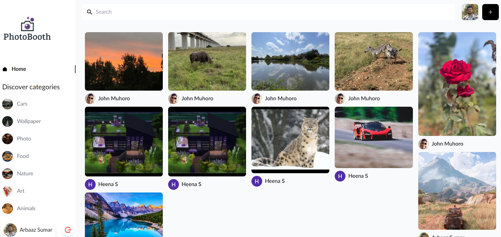

# PhotoBooth
> Share, download and explore amazing images
> Live demo [_here_](https://photobooth-arbaaz.netlify.app/).

## Table of Contents
* [General Info](#general-information)
* [Technologies Used](#technologies-used)
* [Features](#features)
* [Screenshots](#screenshots)
* [Usage](#usage)
* [Project Status](#project-status)
* [Room for Improvement](#room-for-improvement)
* [Contact](#contact)

## General Information
Inspired by Pintrest I wanted to dive into building a social media React app.
Photobooth allows users to sign in using Google auth, upload images, view other images as well as download and comment on them.

## Technologies Used
- React & Tailwind - Frontend
- Sanity - Backend

## Features
List the ready features here:
- Creating Pins
- Viewing images per category
- Downloading/saving images to your profile
- Viewing user profiles
- Share your comments on other images
- Search functionality to find the kind of images you want
- Google Auth functionality

## Screenshots

## Room for Improvement

Room for improvement:
- Allowing other forms of signing up
- Allowing users to add categories

## Contact
[Email](arbaaz970@gmail.com) - feel free to contact me!
